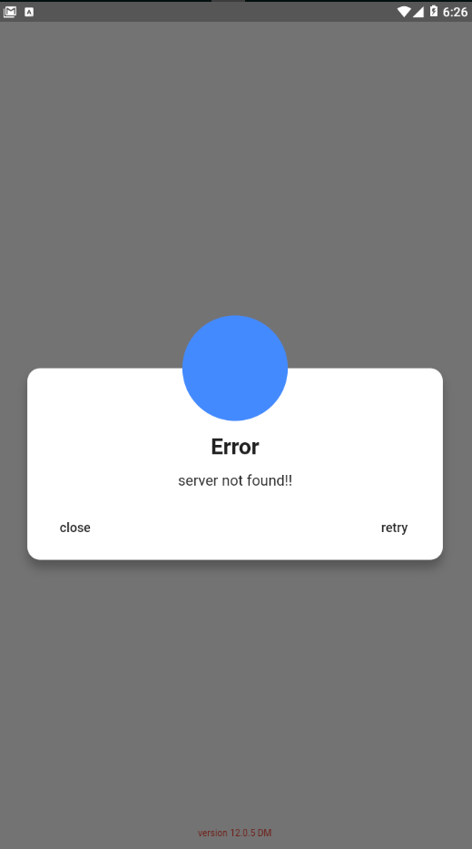

# vDialog

A new Flutter package project for simple and semantic way to fill the content inside the dialog.

## 🎖 Installing

To use this package, add vDialog as a dependency in your pubspec.yaml file.

1. install

```
    dependencies:
      vdialog: ^0.2.1+1
```

2. import
   
```
    import 'package:vdialog/vdialog.dart';
```

## Example

```
    showDialog(
          barrierDismissible: false,
          context: context,
          builder: (BuildContext ctx) => CustomDialog(
            title: "Error",
            buttonOne: this._buttonOne,
            buttonTwo: this._buttonTwo,
            buttonOneText: "retry",
            buttonTwoText: "close",
            content: "server not found!!",
            showButtonOne: true,
            showButtonTwo: true,
          ),
        );
```

## Screenshot




